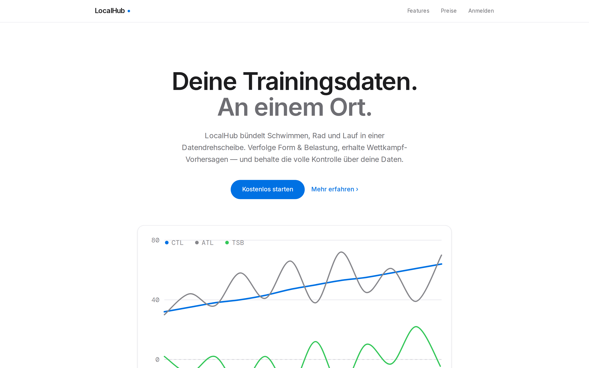
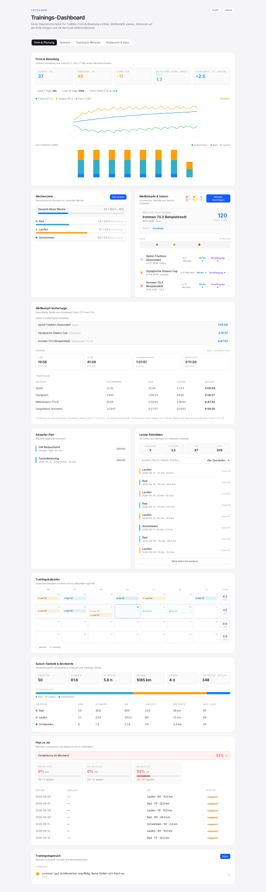
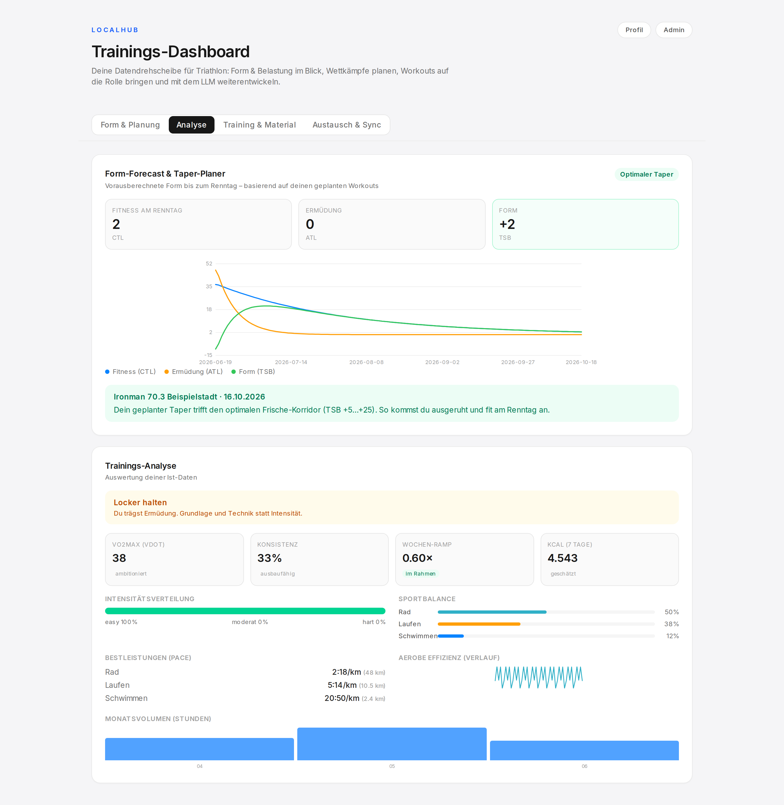
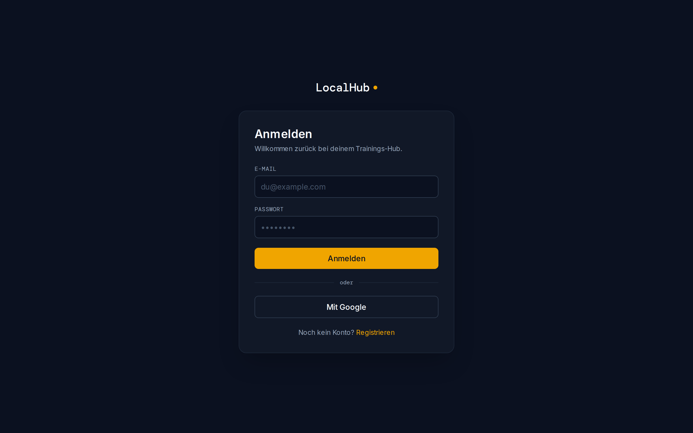
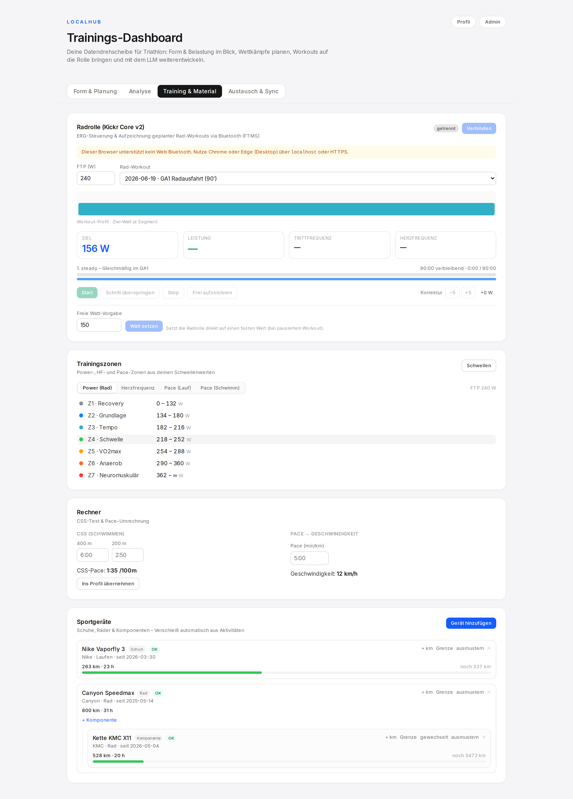
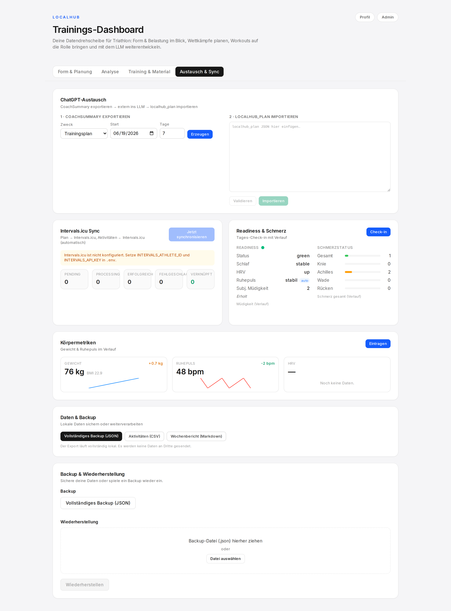

# LocalHub

**LocalHub ist die Datendrehscheibe für dein Triathlon-/Ausdauertraining – nicht der Coach.**
Du bist der Coach, unterstützt durch ein LLM (Claude/ChatGPT). LocalHub sammelt
Daten, wertet Form & Belastung aus, projiziert deine Renntags-Form, exportiert
strukturierte Zusammenfassungen, importiert Pläne, validiert sie hart und hält
Intervals.icu synchron.



---

## Grundidee

LocalHub übernimmt **Datenhaltung, Auswertung und Workflow**, das LLM übernimmt
die **sportwissenschaftliche Entscheidung** (Periodisierung, Planerstellung).

Der Austausch mit dem LLM funktioniert auf **zwei Wegen**:

1. **Copy & Paste (Standard):** LocalHub erzeugt eine modulare `coach_summary`
   (JSON), du fügst sie in einen LLM-Chat ein und importierst den erzeugten
   `localhub_plan` zurück.
2. **Direkte LLM-API (optional):** Mit hinterlegtem `ANTHROPIC_API_KEY` oder
   `OPENAI_API_KEY` generiert LocalHub den Plan direkt per Knopfdruck – das
   Ergebnis landet zur Prüfung im Importfeld und durchläuft denselben harten
   Validierungs-Flow.

> Bewusst **kein** autonomer Coach: keine versteckte Adaptations-/Strategie-Logik.
> Jede Planänderung ist nachvollziehbar und wird vor dem Import validiert.

## Screenshots

| Form & Planung | Analyse (Form-Forecast & Taper) |
|---|---|
|  |  |

<details>
<summary>Weitere Screenshots (Login, Training & Material, Austausch & Sync)</summary>





</details>

> Die Screenshots werden mit Playwright aus dem Seed-Demodatensatz erzeugt:
> `node scripts/screenshots.cjs` (laufender Dev-Server + `npx prisma db seed`).

## Funktionsumfang

**Planung & Auswertung**
- **Form & Belastung** – Performance-Management-Chart (CTL/ATL/TSB), ACWR &
  Aufbaurate, 7-/28-Tage-Load, Wochenvolumen je Disziplin.
- **Form-Forecast & Taper-Planer** – projiziert CTL/ATL/TSB anhand der geplanten
  Workouts bis zum Renntag und bewertet, ob der Taper den optimalen
  Frische-Korridor trifft.
- **Trainings-Analyse** – Intensitätsverteilung & Polarisierung, VO2max/VDOT,
  Sportbalance, Monatsvolumen, aerobe Effizienz, Wochen-Ramp-Rate mit
  Verletzungs-Flag, Konsistenz-Score, Kalorienschätzung, Best-Pace je Disziplin.
- **Wettkampf-Prognosen** – Lauf/Rad/Schwimm-Zeiten, aus eigenen Daten kalibriert.
- **Plan vs. Ist** – Gesamt- und Wochen-Compliance plus Detailabgleich.
- **Wochenziele**, **Trainingskalender**, **Saison-Statistik & Bestwerte**.

**Wettkampf**
- **Wettkämpfe & Saison** – Countdown, Priorität (A/B/C), Periodisierungsphase,
  Saison-Timeline, Ergebniserfassung.
- **Verpflegungsplan** – Carbs/Flüssigkeit/Natrium/Koffein pro Stunde mit
  dauerbasiertem Vorschlag und sportspezifischer Wettkampf-Checkliste.
- **Renntags-Wetter** – Vorhersage für den Renntag via Open-Meteo (Geocoding
  ohne API-Key, Koordinaten werden am Rennen gecacht).

**Training & Material**
- **Radrolle (Wahoo Kickr)** – ERG-Steuerung per Web Bluetooth/FTMS **und**
  Aufzeichnung der Einheit (Speichern als Aktivität + TCX-Export).
- **Trainingszonen** – Power, HF, Lauf- und Schwimm-Pace aus Schwellenwerten.
- **Sportgeräte** – Schuhe/Räder/Komponenten mit km-/Stunden-Verschleiß und
  Wartungs-/Austausch-Hinweisen.

**Gesundheit & Daten**
- **Readiness & Schmerz** – Tages-Check-in; HRV-/Ruhepuls-Trends werden
  automatisch aus den Körpermetriken berechnet.
- **Körpermetriken** – Gewicht, Ruhepuls, HRV, BMI mit Verlauf.
- **Trainingstagebuch**, **Daten & Backup** (JSON-Backup + robuster CSV-Export).

**Austausch & Sync**
- **LLM-Austausch** – `coach_summary`-Export, optionale Direkt-Generierung,
  Planimport mit **Tag-für-Tag-Diff-Vorschau** (neu/ersetzt/geschützt/Ruhe).
- **Intervals.icu-Sync** – idempotente Queue, Status & letzte Ereignisse.

**Plattform**
- Multi-Tenant-SaaS mit Auth (Google + E-Mail/Passwort), Tarif-/Limit-System,
  Stripe-Billing und Admin-Bereich.
- Installierbare **PWA**, Lade-Skeletons, Toasts, Tastatur-Shortcuts,
  Error-Boundaries.

## Tech-Stack

- **TypeScript** durchgehend
- **Next.js 15** (App Router) – Frontend + API Routes
- **React 19**, **Tailwind CSS v4**
- **Prisma ORM** mit **PostgreSQL**
- **Auth.js (NextAuth v5)** – Google OAuth + Credentials
- **Stripe** – Abo-/Billing
- **Vitest** – Tests (281 Tests)
- Integrationen: **Intervals.icu**, **Strava**, **Wahoo**, **Withings** (OAuth)
- Optionale **LLM-API** (Anthropic/OpenAI), **Open-Meteo** (Wetter)
- **Web Bluetooth / FTMS** – Smarttrainer-Steuerung

## Setup (lokale Entwicklung)

Voraussetzung: Node 22+ und ein erreichbarer **PostgreSQL** (lokal oder per Docker).

```bash
# 1. Abhängigkeiten (führt auch `prisma generate` aus)
npm install

# 2. Umgebungsvariablen
cp .env.example .env        # DATABASE_URL, NEXTAUTH_SECRET etc. setzen

# 3. Schema + Migrationen anwenden
npx prisma migrate deploy   # oder: npm run db:migrate (Entwicklung)

# 4. Optional: Demodaten anlegen (Login: demo@localhub.app / password123)
npx prisma db seed

# 5. Entwicklung starten
npm run dev                 # http://localhost:3000

# Weitere Skripte
npm run build               # Produktionsbuild
npm run test                # Vitest
```

Die wichtigsten Variablen stehen in `.env.example` (DB, Auth-Secret,
`ENCRYPTION_KEY`, `CRON_SECRET`, optional Stripe/Google/Integrationen/LLM-Keys).

## Docker

Vollständiger Stack (App + PostgreSQL) via Compose. Migrationen laufen idempotent
beim Container-Start; das DB-Volume überlebt Redeploys.

```bash
cp .env.example .env        # Secrets setzen (POSTGRES_*, NEXTAUTH_URL, …)
docker compose up -d --build   # http://localhost:3000
docker compose logs -f app     # Migrationen + Start beobachten
```

## Deployment (Auto-Deploy via GitHub Actions → SSH)

Bei jedem Merge nach `main` läuft `.github/workflows/deploy.yml`:
CI-Gate (`tsc` + Tests gegen einen Postgres-Service + `next build`) → bei Erfolg
SSH-Deploy auf den VPS, der den Docker-Stack neu baut. Es geht **kein SSH-Key
durch Logs/Chat** – alles liegt in GitHub-Secrets.

Die vollständige Schritt-für-Schritt-Anleitung (Server-Vorbereitung, Deploy-Key,
GitHub-Secrets, HTTPS via Caddy, Betrieb) steht in **[`DEPLOY.md`](DEPLOY.md)**.

## Sicherheit

- **HTTP-Security-Header** (CSP, HSTS, X-Frame-Options, nosniff, Referrer-Policy,
  Permissions-Policy) – in Produktion strikt, im Dev-Modus mit `unsafe-eval` für HMR.
- **Passwort-Policy** server-seitig (Länge, Zeichenvielfalt, Sperrliste), bcrypt-Cost 12.
- **Audit-Logging** für Registrierung, Login (Erfolg/Fehler), Passwortwechsel, Datenexport.
- **Input-Hardening** (Steuerzeichen-/Längen-Limits) auf allen Freitextfeldern.
- **Rate-Limiting** (Login/Registrierung/Passwortwechsel), **Stripe-Webhook-Idempotenz**,
  **Plan-Ablauf-Durchsetzung**, **gehärtete Sessions/Cookies** (7-Tage-JWT, secure in Prod).
- Multi-Tenant: jede Query ist nach `userId` gescoped; Ist-Aktivitäten und
  `completed` Workouts sind unantastbar.

## Wichtige Invarianten

- `ActualActivity` und `completed` Workouts sind **unantastbar** – kein Import
  und kein Sync verändert oder löscht sie.
- Planimport ersetzt ausschließlich **offene** Workouts (`planned`/`synced`) im
  Importzeitraum (Markierung als `replaced`).
- Intervals.icu ist **Spiegel** geplanter Workouts; Ist-Aktivitäten fließen nur
  **von** Intervals.icu **nach** LocalHub.
- Sync ist **idempotent**: wiederholtes Ausführen erzeugt keine Duplikate.

## Radrolle steuern (Wahoo Kickr)

Das Dashboard steuert einen Smarttrainer per **Web Bluetooth** und **FTMS** im
**ERG-Modus**: ein geplantes Rad-Workout wird Segment für Segment abgespielt, die
Ziel-Watt direkt gesendet, Live-Werte (Leistung/Trittfrequenz/HF) gelesen und die
Einheit aufgezeichnet (Speichern als Aktivität + **TCX-Export**).

- Browser mit Web Bluetooth: **Chrome/Edge** (Desktop).
- Sicherer Kontext: `http://localhost` (Dev) oder **HTTPS** (Produktion).
- Watt-Ableitung: explizites Power-Target steuert direkt; sonst aus
  Zone/Intensität bzw. RPE ein FTP-Prozentsatz (`src/integrations/trainer/`).

> Die Trainer-Steuerung läuft vollständig **lokal im Browser** – es werden keine
> Trainer-Daten an einen Server gesendet.

## Architektur

```
src/
  app/                  Next.js App Router (Seiten + API-Routen)
    dashboard/          Dashboard (4 Tabs) + Layout (Toast-Provider)
    api/                coach-summary | plan-import | intervals-sync | races
                        activities | gear | goals | body | checkin | journal
                        billing | profile | export | cron | integrations …
  components/
    dashboard/          UI-Komponenten der Tabs
    charts/             abhängigkeitsfreie SVG-Charts
    ui/                 EmptyState, Skeleton, Toast
  domain/               reine, getestete Logik (kein DB-Zugriff)
    plan-import/        validate/import + Plan-Diff-Vorschau
    coach-summary/      buildCoachSummary, LLM-Prompt/-Extraktion
    training/           trainingLoad, formForecast, analytics, loadAdvisor,
                        vdot, nutrition, weather, races, zones, prediction …
    auth/ security/     Passwort-Policy, Input-Sanitisierung
    export/             TCX, CSV
  integrations/         intervals | trainer (FTMS) | oauth | llm | weather
  lib/                  db, auth-guard, rate-limit, audit, stripe, crypto …
prisma/schema.prisma    Datenmodell + Migrationen
docs/                   CHATGPT_LOCALHUB_PROMPT.md, screenshots/
tests/                  Vitest (rein + DB-gestützte Integrationstests)
```

Die Domain-Logik ist bewusst **rein** (Daten als Parameter), daher leicht
testbar; DB/Netzwerk leben in Importern, Sync, Integrationen und API-Routen.

## Workflow: `coach_summary` ↔ `localhub_plan`

1. LocalHub sammelt Daten (Intervals.icu / manuell).
2. LocalHub erzeugt eine modulare `coach_summary` (JSON).
3. Plan vom LLM erzeugen lassen – per Copy & Paste **oder** direkt über die API.
4. LocalHub validiert den `localhub_plan` **hart** und zeigt eine Diff-Vorschau.
5. Import ersetzt **nur offene** geplante Workouts im Importzeitraum.
6. Abgeschlossene/Ist-Aktivitäten bleiben vollständig geschützt.
7. Offene geplante Workouts werden idempotent nach Intervals.icu synchronisiert.

Der System-Prompt für das LLM liegt in
[`docs/CHATGPT_LOCALHUB_PROMPT.md`](docs/CHATGPT_LOCALHUB_PROMPT.md).

## Tests & Build

```bash
npm run test    # 281 Tests (Domain-Logik + DB-gestützte Integrationstests)
npm run build   # Next.js Produktionsbuild (inkl. Typecheck)
```

DB-gestützte Tests nutzen `TEST_DATABASE_URL` (siehe `tests/helpers/testDb.ts`)
und laufen sequenziell gegen eine separate Test-Datenbank – die Entwicklungs-DB
wird nicht berührt.
